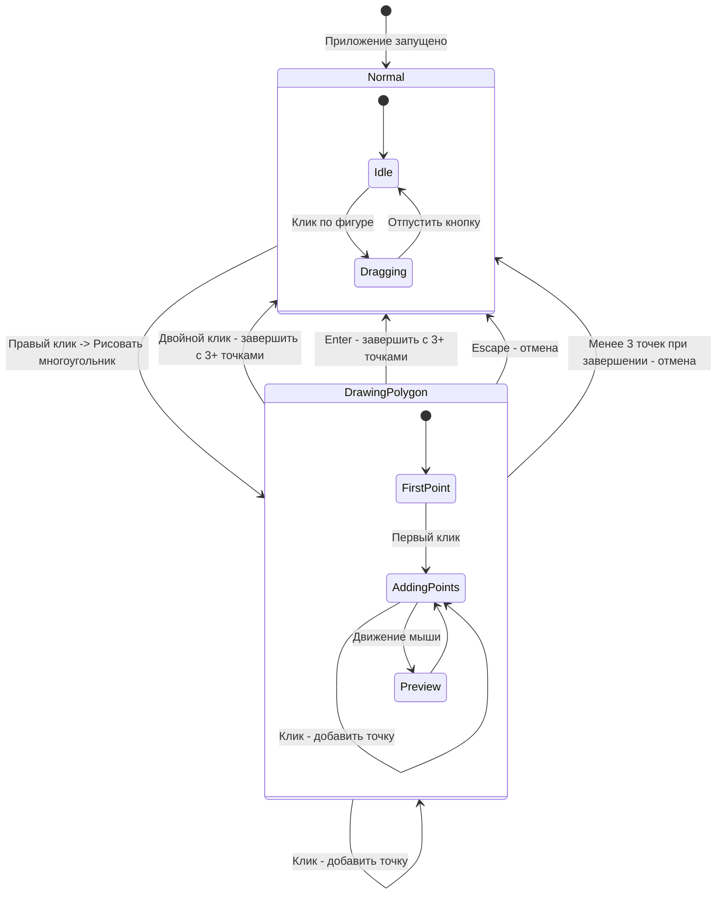
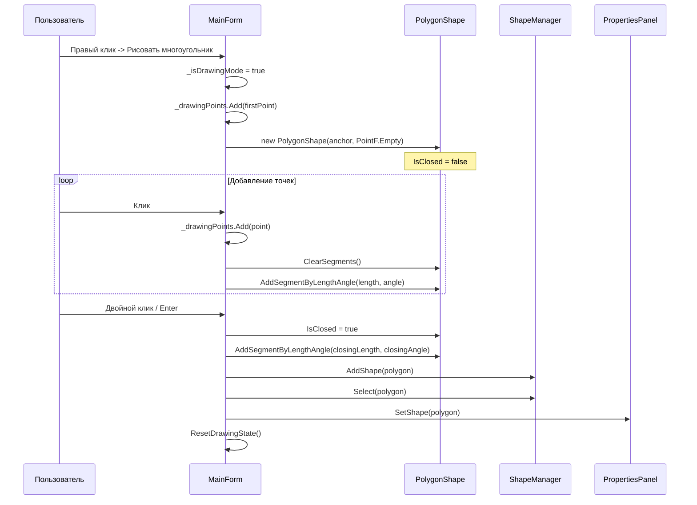

# Детальный дизайн режима рисования многоугольника

## 1. Обзор решения

### 1.1 Цель
Реализовать интерактивный режим рисования многоугольника, позволяющий пользователю создавать фигуры с нуля путём кликов на холсте.

### 1.2 Выбранный подход
Используется **Вариант 1** из анализа - режим рисования для [`PolygonShape`](../Shapes/PolygonShape.cs). Это минимальные изменения с использованием существующей инфраструктуры.

### 1.3 Ключевые преимущества
- Минимальные изменения кода
- Использование существующего класса [`PolygonShape`](../Shapes/PolygonShape.cs:81)
- Пошаговое расширение функциональности

---

## 2. Диаграмма состояний

### 2.1 Состояния режима рисования



### 2.2 Описание состояний

| Состояние | Описание | Допустимые действия |
|-----------|----------|---------------------|
| `Normal` | Обычный режим работы | Выбор фигур, перетаскивание, контекстное меню |
| `DrawingPolygon.FirstPoint` | Ожидание первой точки | Клик - добавить первую точку |
| `DrawingPolygon.AddingPoints` | Добавление точек | Клик - добавить точку, Двойной клик - завершить |
| `DrawingPolygon.Preview` | Предпросмотр линии | Движение мыши - обновить preview |

---

## 3. Состояние в MainForm

### 3.1 Новые поля

```csharp
// === Режим рисования многоугольника ===

/// <summary>
/// Флаг активного режима рисования
/// </summary>
private bool _isDrawingMode;

/// <summary>
/// Список точек, добавленных пользователем
/// </summary>
private List<PointF> _drawingPoints = new();

/// <summary>
/// Текущая позиция мыши для предпросмотра следующей линии
/// </summary>
private Point _currentMousePosition;

/// <summary>
/// Текущая рисуемая фигура (ещё не добавлена в ShapeManager)
/// </summary>
private PolygonShape? _drawingShape;
```

### 3.2 Enum для режимов (опционально для расширяемости)

```csharp
/// <summary>
/// Режим работы редактора
/// </summary>
private enum EditorMode
{
    Normal,         // Обычный режим
    DrawingPolygon, // Рисование многоугольника
    // Будущие режимы:
    // DrawingPolyline,   // Рисование ломаной линии
    // DrawingFreeform    // Свободное рисование
}

private EditorMode _currentMode = EditorMode.Normal;
```

---

## 4. UI элементы

### 4.1 Пункт контекстного меню

**Расположение:** [`MainForm.cs`](../MainForm.cs:90) - метод `SetupCreateShapeMenu()`

```csharp
// После существующих пунктов меню
_createShapeMenu.Items.Add(new ToolStripSeparator());

// Новый пункт для рисования
_createShapeMenu.Items.Add("✏️ Рисовать многоугольник", null, StartDrawingPolygon_Click!);
```

### 4.2 Визуальный индикатор режима

**Реализация:** Нарисовать полосу в верхней части экрана

```csharp
/// <summary>
/// Нарисовать индикатор режима рисования
/// </summary>
private void DrawDrawingModeIndicator(Graphics g)
{
    if (!_isDrawingMode) return;
    
    string modeText = "РЕЖИМ РИСОВАНИЯ | Клик - добавить точку | Двойной клик/Enter - завершить | Esc - отмена";
    
    using (var font = new Font("Segoe UI", 14F, FontStyle.Bold))
    using (var brush = new SolidBrush(Color.White))
    using (var bgBrush = new SolidBrush(Color.FromArgb(52, 152, 219)))
    {
        var textSize = g.MeasureString(modeText, font);
        var rect = new RectangleF(0, 0, ClientSize.Width, 40);
        
        g.FillRectangle(bgBrush, rect);
        g.DrawString(modeText, font, brush, 
            (ClientSize.Width - textSize.Width) / 2, 10);
    }
}
```

### 4.3 Обновлённая подсказка внизу экрана

```csharp
// В методе OnPaint
string hint = _isDrawingMode 
    ? "Клик - добавить точку | Двойной клик/Enter - завершить | Esc - отмена"
    : "F4 - панель свойств | Esc - выход | Правый клик - добавить фигуру";
```

---

## 5. Обработка событий

### 5.1 Вход в режим рисования

```csharp
/// <summary>
/// Начать режим рисования многоугольника
/// </summary>
private void StartDrawingPolygon_Click(object? sender, EventArgs e)
{
    // Входим в режим рисования
    _isDrawingMode = true;
    _drawingPoints.Clear();
    _drawingShape = null;
    
    // Первая точка - место клика контекстного меню
    _drawingPoints.Add(new PointF(_menuClickLocation.X, _menuClickLocation.Y));
    
    // Создаём пустой многоугольник
    _drawingShape = new PolygonShape(_menuClickLocation, PointF.Empty)
    {
        FillColor = Color.LightYellow,
        IsClosed = false  // Пока рисуем - незамкнутый
    };
    
    // Меняем курсор
    Cursor = Cursors.Cross;
    
    Invalidate();
}
```

### 5.2 Обработка клика (MouseDown)

**Изменения в методе [`MainForm_MouseDown`](../MainForm.cs:200):**

```csharp
private void MainForm_MouseDown(object? sender, MouseEventArgs e)
{
    // В режиме рисования обрабатываем отдельно
    if (_isDrawingMode)
    {
        HandleDrawingClick(e);
        return;
    }
    
    // ... существующий код ...
}

/// <summary>
/// Обработка клика в режиме рисования
/// </summary>
private void HandleDrawingClick(MouseEventArgs e)
{
    if (e.Button != MouseButtons.Left) return;
    
    // Добавляем новую точку
    _drawingPoints.Add(new PointF(e.Location.X, e.Location.Y));
    
    // Обновляем фигуру
    UpdateDrawingShape();
    
    Invalidate();
}
```

### 5.3 Обработка двойного клика

```csharp
// В SetupFullScreen() добавить подписку
MouseDown += MainForm_MouseDown;
MouseDoubleClick += MainForm_MouseDoubleClick;  // Добавить

/// <summary>
/// Двойной клик - завершить рисование
/// </summary>
private void MainForm_MouseDoubleClick(object? sender, MouseEventArgs e)
{
    if (!_isDrawingMode) return;
    
    CompleteDrawing();
}
```

### 5.4 Обработка клавиш

**Изменения в методе [`MainForm_KeyDown`](../MainForm.cs:380):**

```csharp
private void MainForm_KeyDown(object? sender, KeyEventArgs e)
{
    // Приоритет для режима рисования
    if (_isDrawingMode)
    {
        switch (e.KeyCode)
        {
            case Keys.Enter:
                CompleteDrawing();
                e.Handled = true;
                return;
                
            case Keys.Escape:
                CancelDrawing();
                e.Handled = true;
                return;
        }
    }
    
    // Существующая обработка
    switch (e.KeyCode)
    {
        case Keys.F4:
            TogglePropertiesPanel();
            break;
            
        case Keys.Escape:
            // ... существующий код ...
            break;
    }
}
```

### 5.5 Движение мыши (MouseMove)

**Изменения в методе [`MainForm_MouseMove`](../MainForm.cs:267):**

```csharp
private void MainForm_MouseMove(object? sender, MouseEventArgs e)
{
    // В режиме рисования - обновляем позицию для preview
    if (_isDrawingMode)
    {
        _currentMousePosition = e.Location;
        Invalidate();
        return;
    }
    
    // ... существующий код ...
}
```

---

## 6. Визуальный Feedback

### 6.1 Отрисовка в режиме рисования

**Изменения в методе [`MainForm_Paint`](../MainForm.cs:169):**

```csharp
private void MainForm_Paint(object? sender, PaintEventArgs e)
{
    e.Graphics.SmoothingMode = SmoothingMode.AntiAlias;
    
    // Рисуем область для фигур
    DrawCanvasArea(e.Graphics);
    
    // Рисуем все фигуры
    _shapeManager.DrawAll(e.Graphics);
    
    // === НОВОЕ: Отрисовка в режиме рисования ===
    if (_isDrawingMode)
    {
        DrawPolygonPreview(e.Graphics);
        DrawDrawingModeIndicator(e.Graphics);
    }
}
```

### 6.2 Отрисовка превью многоугольника

```csharp
/// <summary>
/// Нарисовать превью рисуемого многоугольника
/// </summary>
private void DrawPolygonPreview(Graphics g)
{
    if (_drawingPoints.Count == 0) return;
    
    // 1. Рисуем линии между добавленными точками
    if (_drawingPoints.Count >= 2)
    {
        using (var pen = new Pen(Color.DodgerBlue, 2f))
        {
            pen.DashStyle = DashStyle.Dash;
            for (int i = 0; i < _drawingPoints.Count - 1; i++)
            {
                g.DrawLine(pen, _drawingPoints[i], _drawingPoints[i + 1]);
            }
        }
    }
    
    // 2. Рисуем preview линию к текущей позиции мыши
    if (_drawingPoints.Count >= 1)
    {
        var lastPoint = _drawingPoints[_drawingPoints.Count - 1];
        
        // Пунктирная линия к курсору
        using (var pen = new Pen(Color.Gray, 1f))
        {
            pen.DashStyle = DashStyle.Dot;
            g.DrawLine(pen, lastPoint, _currentMousePosition);
        }
        
        // Preview замыкающей линии (если 3+ точек)
        if (_drawingPoints.Count >= 3)
        {
            using (var pen = new Pen(Color.LightGray, 1f))
            {
                pen.DashStyle = DashStyle.Dot;
                g.DrawLine(pen, _currentMousePosition, _drawingPoints[0]);
            }
        }
    }
    
    // 3. Рисуем маркеры точек
    DrawPointMarkers(g);
}

/// <summary>
/// Нарисовать маркеры добавленных точек
/// </summary>
private void DrawPointMarkers(Graphics g)
{
    const int markerRadius = 6;
    
    for (int i = 0; i < _drawingPoints.Count; i++)
    {
        var point = _drawingPoints[i];
        
        // Первая точка - зелёная, остальные - синие
        Color markerColor = (i == 0) ? Color.Green : Color.DodgerBlue;
        
        using (var brush = new SolidBrush(markerColor))
        using (var outlinePen = new Pen(Color.White, 2f))
        {
            var rect = new RectangleF(
                point.X - markerRadius,
                point.Y - markerRadius,
                markerRadius * 2,
                markerRadius * 2
            );
            
            g.FillEllipse(brush, rect);
            g.DrawEllipse(outlinePen, rect);
        }
        
        // Номер точки
        using (var font = new Font("Segoe UI", 8f))
        using (var brush = new SolidBrush(Color.Black))
        {
            var label = (i + 1).ToString();
            g.DrawString(label, font, brush, point.X + 10, point.Y - 10);
        }
    }
}
```

---

## 7. Логика построения многоугольника

### 7.1 Обновление фигуры при добавлении точки

```csharp
/// <summary>
/// Обновить рисуемую фигуру на основе точек
/// </summary>
private void UpdateDrawingShape()
{
    if (_drawingShape == null || _drawingPoints.Count < 2) return;
    
    // Очищаем существующие отрезки
    _drawingShape.ClearSegments();
    
    // Первая точка относительно GlobalOrigin
    var origin = new PointF(
        _drawingPoints[0].X - _menuClickLocation.X,
        _drawingPoints[0].Y - _menuClickLocation.Y
    );
    _drawingShape.OriginPoint = origin;
    
    // Вычисляем отрезки между точками
    for (int i = 1; i < _drawingPoints.Count; i++)
    {
        var prev = _drawingPoints[i - 1];
        var curr = _drawingPoints[i];
        
        // Длина отрезка
        float dx = curr.X - prev.X;
        float dy = curr.Y - prev.Y;
        float length = (float)Math.Sqrt(dx * dx + dy * dy);
        
        // Угол относительно предыдущего отрезка
        float angle = CalculateSegmentAngle(i);
        
        _drawingShape.AddSegmentByLengthAngle(length, angle);
    }
}

/// <summary>
/// Вычислить угол отрезка относительно предыдущего
/// </summary>
private float CalculateSegmentAngle(int segmentIndex)
{
    if (segmentIndex <= 0 || segmentIndex >= _drawingPoints.Count)
        return 0;
    
    var prev = _drawingPoints[segmentIndex - 1];
    var curr = _drawingPoints[segmentIndex];
    
    // Угол относительно горизонтали
    float dx = curr.X - prev.X;
    float dy = curr.Y - prev.Y;
    float absoluteAngle = (float)(Math.Atan2(dy, dx) * 180 / Math.PI);
    
    // Для первого отрезка возвращаем абсолютный угол
    if (segmentIndex == 1)
        return absoluteAngle;
    
    // Для остальных - относительный угол
    var prevPrev = _drawingPoints[segmentIndex - 2];
    float prevDx = prev.X - prevPrev.X;
    float prevDy = prev.Y - prevPrev.Y;
    float prevAngle = (float)(Math.Atan2(prevDy, prevDx) * 180 / Math.PI);
    
    return absoluteAngle - prevAngle;
}
```

### 7.2 Завершение рисования

```csharp
/// <summary>
/// Завершить рисование многоугольника
/// </summary>
private void CompleteDrawing()
{
    // Минимум 3 точки для многоугольника
    if (_drawingPoints.Count < 3)
    {
        ShowTooltip("Для многоугольника нужно минимум 3 точки");
        CancelDrawing();
        return;
    }
    
    if (_drawingShape == null)
    {
        CancelDrawing();
        return;
    }
    
    // Замыкаем фигуру
    _drawingShape.IsClosed = true;
    
    // Добавляем замыкающий отрезок
    AddClosingSegment();
    
    // Устанавливаем стили границ
    for (int i = 0; i < _drawingShape.Segments.Count; i++)
    {
        _drawingShape.SetBorder(i, 2f, Color.DarkBlue);
    }
    
    // Добавляем в менеджер фигур
    _shapeManager.AddShape(_drawingShape);
    _shapeManager.Select(_drawingShape);
    
    // Открываем панель свойств для редактирования
    if (!_propertiesPanelVisible)
    {
        TogglePropertiesPanel();
    }
    _propertiesPanel.SetShape(_drawingShape);
    
    // Сбрасываем состояние
    ResetDrawingState();
    
    Invalidate();
}

/// <summary>
/// Добавить замыкающий отрезок
/// </summary>
private void AddClosingSegment()
{
    if (_drawingPoints.Count < 3 || _drawingShape == null) return;
    
    var last = _drawingPoints[_drawingPoints.Count - 1];
    var first = _drawingPoints[0];
    
    float dx = first.X - last.X;
    float dy = first.Y - last.Y;
    float length = (float)Math.Sqrt(dx * dx + dy * dy);
    
    // Угол замыкающего отрезка
    float angle = CalculateSegmentAngle(_drawingPoints.Count - 1);
    float closingAngle = (float)(Math.Atan2(dy, dx) * 180 / Math.PI);
    
    // Вычисляем относительный угол
    var prev = _drawingPoints[_drawingPoints.Count - 2];
    float prevDx = last.X - prev.X;
    float prevDy = last.Y - prev.Y;
    float prevAngle = (float)(Math.Atan2(prevDy, prevDx) * 180 / Math.PI);
    
    _drawingShape.AddSegmentByLengthAngle(length, closingAngle - prevAngle);
}
```

### 7.3 Отмена рисования

```csharp
/// <summary>
/// Отменить рисование
/// </summary>
private void CancelDrawing()
{
    ResetDrawingState();
    Invalidate();
}

/// <summary>
/// Сбросить состояние рисования
/// </summary>
private void ResetDrawingState()
{
    _isDrawingMode = false;
    _drawingPoints.Clear();
    _drawingShape = null;
    Cursor = Cursors.Default;
}
```

---

## 8. Интеграция с существующей архитектурой

### 8.1 Создание PolygonShape с нуля



### 8.2 Добавление в ShapeManager

```csharp
// В CompleteDrawing()
_shapeManager.AddShape(_drawingShape);  // Добавляет в список Shapes
_shapeManager.Select(_drawingShape);     // Устанавливает SelectedShape
```

### 8.3 Открытие PropertiesForm для редактирования

```csharp
// В CompleteDrawing() после добавления фигуры
if (!_propertiesPanelVisible)
{
    TogglePropertiesPanel();  // Показываем панель
}
_propertiesPanel.SetShape(_drawingShape);  // Устанавливаем фигуру для редактирования
```

---

## 9. Список файлов для изменения

| Файл | Изменения | Приоритет |
|------|-----------|-----------|
| [`MainForm.cs`](../MainForm.cs) | Все основные изменения | Высокий |
| [`MainForm.Designer.cs`](../MainForm.Designer.cs) | Не требуется | - |

### 9.1 Детальный список изменений в MainForm.cs

| Метод/Область | Изменение | Описание |
|---------------|-----------|----------|
| Поля класса | Добавить | `_isDrawingMode`, `_drawingPoints`, `_currentMousePosition`, `_drawingShape` |
| `SetupCreateShapeMenu()` | Добавить | Пункт меню "Рисовать многоугольник" |
| `SetupFullScreen()` | Добавить | Подписка на `MouseDoubleClick` |
| `MainForm_Paint()` | Изменить | Добавить отрисовку preview и индикатора |
| `MainForm_MouseDown()` | Изменить | Проверка режима рисования |
| `MainForm_MouseDoubleClick()` | Добавить | Обработка двойного клика |
| `MainForm_MouseMove()` | Изменить | Обновление позиции мыши в режиме рисования |
| `MainForm_KeyDown()` | Изменить | Обработка Enter/Escape в режиме рисования |
| Новые методы | Добавить | Все методы из разделов 5-7 |

---

## 10. Последовательность реализации

### Этап 1: Базовая инфраструктура
1. Добавить поля состояния в `MainForm`
2. Добавить пункт меню "Рисовать многоугольник"
3. Реализовать `StartDrawingPolygon_Click()`
4. Реализовать `ResetDrawingState()`

### Этап 2: Обработка ввода
5. Добавить проверку режима в `MainForm_MouseDown()`
6. Реализовать `HandleDrawingClick()`
7. Добавить подписку на `MouseDoubleClick`
8. Реализовать обработку Enter/Escape в `MainForm_KeyDown()`
9. Обновить `MainForm_MouseMove()` для preview

### Этап 3: Визуальный feedback
10. Реализовать `DrawPolygonPreview()`
11. Реализовать `DrawPointMarkers()`
12. Реализовать `DrawDrawingModeIndicator()`
13. Обновить `MainForm_Paint()`

### Этап 4: Логика построения
14. Реализовать `UpdateDrawingShape()`
15. Реализовать `CalculateSegmentAngle()`
16. Реализовать `CompleteDrawing()`
17. Реализовать `AddClosingSegment()`
18. Реализовать `CancelDrawing()`

### Этап 5: Интеграция
19. Интегрировать с `ShapeManager`
20. Интегрировать с `PropertiesPanel`
21. Тестирование

---

## 11. Критерии приёмки

### 11.1 Функциональные требования
- [ ] Пользователь может войти в режим рисования через контекстное меню
- [ ] Первый клик добавляет начальную точку
- [ ] Последующие клики добавляют новые точки
- [ ] Двойной клик завершает рисование (минимум 3 точки)
- [ ] Enter завершает рисование
- [ ] Escape отменяет рисование
- [ ] Фигура корректно добавляется в ShapeManager
- [ ] PropertiesPanel открывается для редактирования

### 11.2 Визуальные требования
- [ ] Маркеры точек отображаются корректно
- [ ] Preview линия следует за курсором
- [ ] Индикатор режима отображается вверху экрана
- [ ] Подсказки внизу экрана обновляются

### 11.3 Нефункциональные требования
- [ ] Нет изменений в других классах (только MainForm)
- [ ] Код соответствует существующему стилю
- [ ] Добавлены XML-комментарии для новых методов

---

## 12. Риски и ограничения

### 12.1 Риски
| Риск | Вероятность | Влияние | Митигация |
|------|-------------|---------|-----------|
| Конфликт с существующим drag&drop | Низкая | Среднее | Проверка `_isDrawingMode` в начале обработчиков |
| Некорректные углы при построении | Средняя | Низкое | Тщательное тестирование `CalculateSegmentAngle()` |

### 12.2 Ограничения
- Только многоугольники (PolygonShape)
- Нет поддержки свободного рисования
- Нет undo/redo для процесса рисования

---

## 13. Будущие улучшения

1. **Поддержка ломаных линий** - незамкнутые фигуры
2. **Свободное рисование** - рисование мышью без кликов
3. **Undo последней точки** - Ctrl+Z для отмены последней точки
4. **Привязка к сетке** - Snap-to-grid при рисовании
5. **Магнитная привязка** - Snap к существующим фигурам
