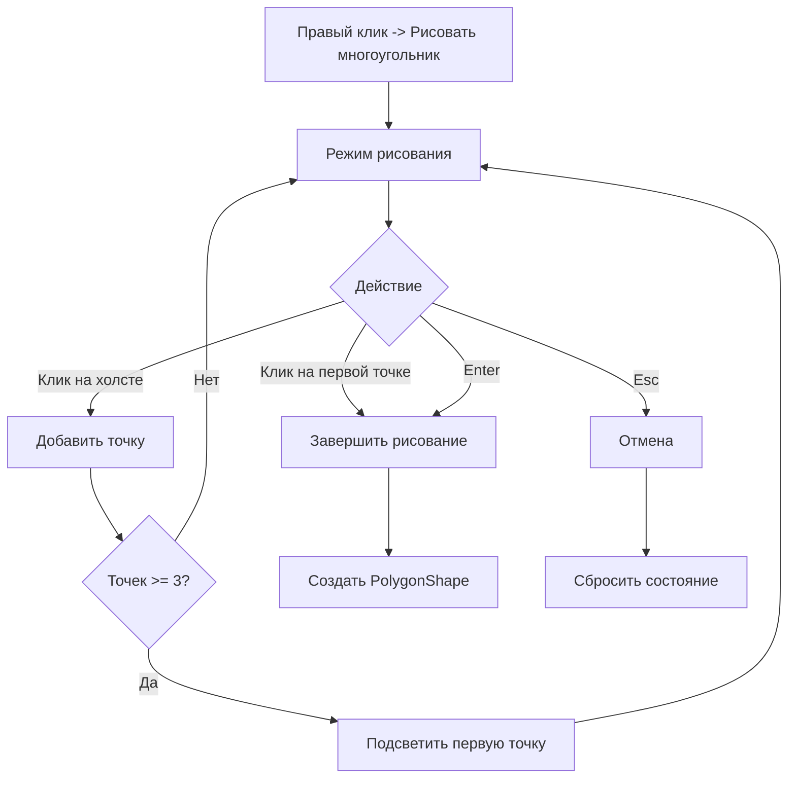

# План исправления бага: сворачивание окна при двойном клике

## 1. Описание проблемы

При завершении рисования многоугольника двойным кликом программа сворачивается. Это происходит из-за системного поведения Windows для форм в полноэкранном режиме (`FormBorderStyle.None` + `WindowState.Maximized`).

## 2. Анализ причин

### 2.1 Текущая реализация
- Форма имеет `FormBorderStyle.None` и `WindowState.Maximized`
- Для завершения рисования используется событие `MouseDoubleClick`
- Windows обрабатывает двойной клик на полноэкранной форме как сигнал для сворачивания

### 2.2 Проблемный код
```csharp
// MainForm.cs:887-892
private void MainForm_MouseDoubleClick(object? sender, MouseEventArgs e)
{
    if (!_isDrawingMode) return;
    CompleteDrawing();
}
```

## 3. Решение

### 3.1 Подход: Замыкание кликом на первую точку

Вместо двойного клика использовать **клик на первую точку** для замыкания многоугольника. Это стандартный паттерн в графических редакторах.

### 3.2 Изменения в коде

#### 3.2.1 Модификация HandleDrawingClick

Добавить проверку: если клик близко к первой точке (при наличии 3+ точек) - завершить рисование.

```csharp
private void HandleDrawingClick(MouseEventArgs e)
{
    if (e.Button != MouseButtons.Left) return;
    
    // Проверяем клик на первую точку для замыкания (нужно минимум 3 точки)
    if (_drawingPoints.Count >= 3)
    {
        const float closeThreshold = 15f; // Радиус захвата первой точки
        var firstPoint = _drawingPoints[0];
        float dx = e.Location.X - firstPoint.X;
        float dy = e.Location.Y - firstPoint.Y;
        float distance = (float)Math.Sqrt(dx * dx + dy * dy);
        
        if (distance <= closeThreshold)
        {
            CompleteDrawing();
            return;
        }
    }
    
    // Добавляем новую точку
    _drawingPoints.Add(new PointF(e.Location.X, e.Location.Y));
    UpdateDrawingShape();
    Invalidate();
}
```

#### 3.2.2 Улучшение визуального feedback

Подсветить первую точку при наведении, показывая что на неё можно кликнуть для замыкания:

```csharp
private void DrawPointMarkers(Graphics g)
{
    const int markerRadius = 6;
    
    for (int i = 0; i < _drawingPoints.Count; i++)
    {
        var point = _drawingPoints[i];
        Color markerColor;
        int radius = markerRadius;
        
        if (i == 0)
        {
            // Первая точка - зелёная, увеличенная если 3+ точек
            markerColor = _drawingPoints.Count >= 3 ? Color.LimeGreen : Color.Green;
            radius = _drawingPoints.Count >= 3 ? markerRadius + 3 : markerRadius;
        }
        else
        {
            markerColor = Color.DodgerBlue;
        }
        
        // ... остальной код отрисовки
    }
}
```

#### 3.2.3 Обновление подсказок

Изменить текст подсказки:

```csharp
string modeText = "РЕЖИМ РИСОВАНИЯ | Клик - добавить точку | Клик на первую точку/Enter - завершить | Esc - отмена";
```

#### 3.2.4 Удаление или сохранение MouseDoubleClick

Можно сохранить `MouseDoubleClick` как резервный способ, но добавить подавление системного поведения:

```csharp
private void MainForm_MouseDoubleClick(object? sender, MouseEventArgs e)
{
    if (!_isDrawingMode) return;
    
    // Завершаем рисование
    CompleteDrawing();
    
    // Подавляем дальнейшую обработку
    e = null!; // Предотвращаем системную обработку
}
```

Или полностью удалить использование двойного клика для завершения.

### 3.3 Альтернативное решение: WndProc

Можно перехватить сообщение Windows о сворачивании:

```csharp
protected override void WndProc(ref Message m)
{
    const int WM_SYSCOMMAND = 0x0112;
    const int SC_MINIMIZE = 0xF020;
    
    if (m.Msg == WM_SYSCOMMAND && m.WParam.ToInt32() == SC_MINIMIZE)
    {
        if (_isDrawingMode)
        {
            // Игнорируем сворачивание в режиме рисования
            return;
        }
    }
    
    base.WndProc(ref m);
}
```

## 4. Рекомендуемый план

1. **Основное изменение**: Добавить завершение по клику на первую точку
2. **Визуальный feedback**: Подсвечивать первую точку когда возможно замыкание
3. **Обновить подсказки**: Информировать пользователя о новом способе завершения
4. **Опционально**: Добавить WndProc для подавления сворачивания

## 5. Диаграмма обновлённого workflow



## 6. Файлы для изменения

| Файл | Изменения |
|------|-----------|
| `MainForm.cs` | Модификация `HandleDrawingClick`, `DrawPointMarkers`, подсказок |
| `MainForm.cs` | Опционально: добавление `WndProc` |

## 7. Тестирование

1. Запустить режим рисования
2. Добавить 3+ точки кликами
3. Кликнуть на первую (зелёную) точку
4. Проверить, что многоугольник создан корректно
5. Проверить, что окно не сворачивается
