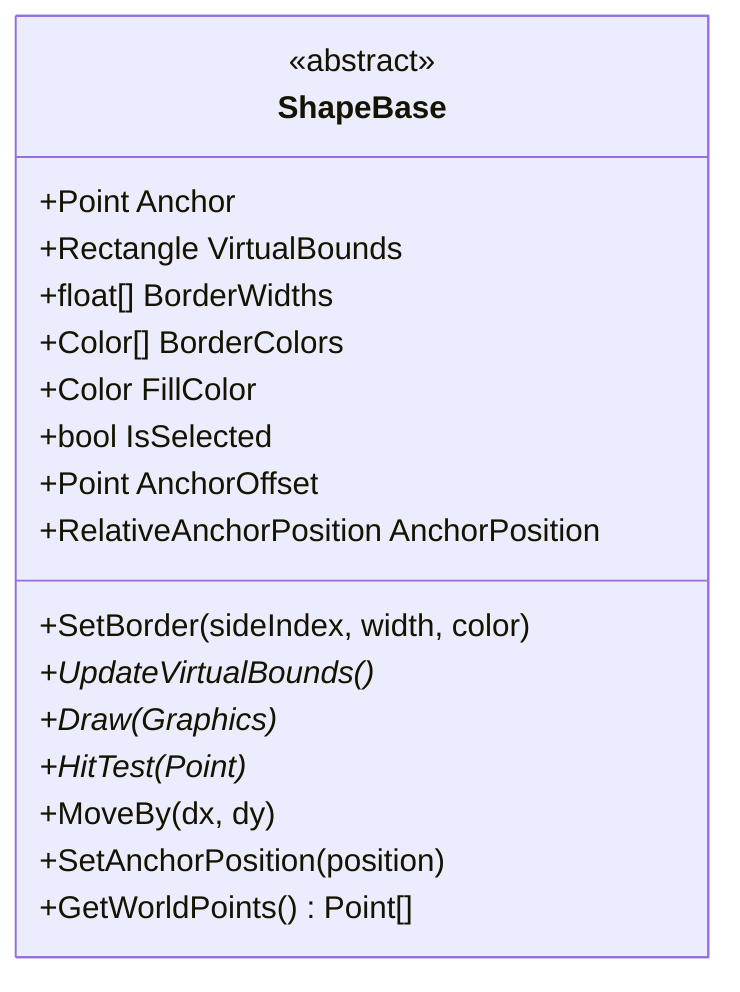
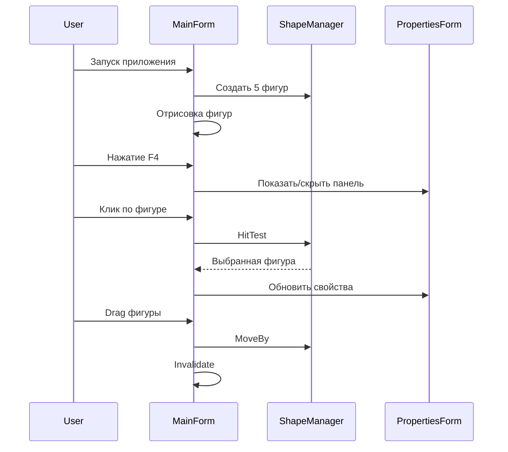
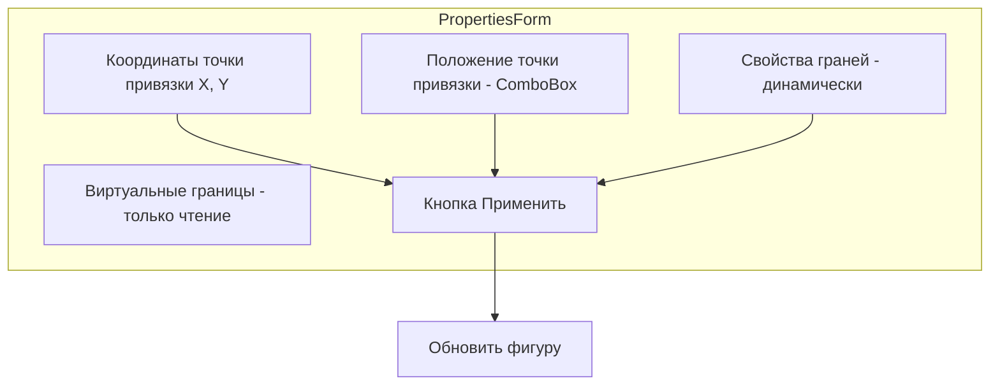
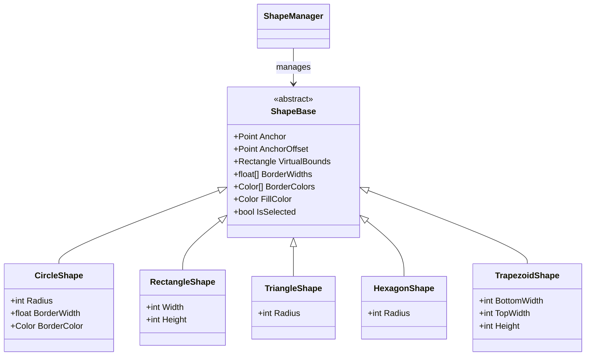

# План исправлений проекта графического редактора (ЛР1)

## Текущее состояние проекта

Проект имеет базовую структуру, но требует значительной доработки:

### Что уже реализовано:
- Базовый класс [`ShapeBase`](Shapes/ShapeBase.cs) с точкой привязки и виртуальными границами
- Классы фигур: [`RectangleShape`](Shapes/RectangleShape.cs), [`TriangleShape`](Shapes/TriangleShape.cs), [`HexagonShape`](Shapes/HexagonShape.cs), [`TrapezoidShape`](Shapes/TrapezoidShape.cs)
- Заготовка [`CircleShape`](Shapes/CircleShape.cs) - пустой класс
- [`ShapeManager`](Core/ShapeManager.cs) для управления фигурами
- Заготовки форм [`MainForm`](MainForm.cs) и [`PropertiesForm`](PropertiesForm.cs)

### Основные проблемы:
1. Используются `PointF` вместо `Point` - нужны целые координаты
2. Нет возможности менять положение точки привязки относительно фигуры
3. [`CircleShape`](Shapes/CircleShape.cs) не реализован
4. Нет полноэкранного режима
5. Нет drag&drop функциональности
6. Панель свойств не функциональна
7. Нет начальных 5 фигур на экране
8. Проблема с соединением линий разной толщины

---

## Детальный план исправлений

### 1. Переработка базового класса ShapeBase

**Файл:** [`Shapes/ShapeBase.cs`](Shapes/ShapeBase.cs)

**Изменения:**
- Заменить `PointF` на `Point` для целочисленных координат
- Заменить `RectangleF` на `Rectangle`
- Добавить свойство `AnchorOffset` - смещение точки привязки относительно геометрического центра фигуры
- Добавить метод `SetAnchorPosition()` для изменения положения точки привязки
- Добавить свойство `RelativeAnchorPosition` - перечисление позиций: Center, TopLeft, TopRight, BottomLeft, BottomRight, Custom

### 2. Реализация CircleShape

**Файл:** [`Shapes/CircleShape.cs`](Shapes/CircleShape.cs)

**Особенности:**
- Одна толщина линии и один цвет для всей окружности
- Радиус - целое число
- Виртуальные границы - квадрат, описанный вокруг окружности
- Точка привязки может быть в центре или смещена

### 3. Обновление классов фигур

**Файлы:** 
- [`Shapes/RectangleShape.cs`](Shapes/RectangleShape.cs)
- [`Shapes/TriangleShape.cs`](Shapes/TriangleShape.cs)
- [`Shapes/HexagonShape.cs`](Shapes/HexagonShape.cs)
- [`Shapes/TrapezoidShape.cs`](Shapes/TrapezoidShape.cs)

**Изменения:**
- Перейти на целочисленные координаты (`Point`, `Rectangle`)
- Добавить поддержку `AnchorOffset`
- Реализовать метод `SetAnchorPosition()`

### 4. Корректное соединение линий разной толщины

**Проблема:** При соединении линий разной толщины образуются разрывы.

**Решение:**
- Использовать `GraphicsPath` для создания контура фигуры
- Сначала заливать фигуру одним цветом
- Затем рисовать линии с `LineJoin.Miter` или использовать `GraphicsPath.Widen()`
- Альтернатива: рисовать линии с запасом, перекрывая стыки

### 5. Переработка MainForm

**Файлы:** [`MainForm.cs`](MainForm.cs), [`MainForm.Designer.cs`](MainForm.Designer.cs)

**Требования:**
- Полноэкранный режим: `FormBorderStyle = None`, `WindowState = Maximized`
- Только заголовок окна и кнопки закрытия/сворачивания
- Создание 5 фигур при запуске
- Drag&drop для перемещения фигур мышью
- Обработка клавиши F4 для показа/скрытия панели свойств
- Перерисовка при изменениях

### 6. Переработка PropertiesForm

**Файлы:** [`PropertiesForm.cs`](PropertiesForm.cs), [`PropertiesForm.Designer.cs`](PropertiesForm.Designer.cs)

**Требования:**
- Показывать координаты точки привязки X, Y - редактируемые
- Показывать виртуальные границы: Left/Top (верх-лево), Right/Bottom (низ-право) - только чтение
- Для каждой грани фигуры: толщина и цвет
- Для окружности: одна толщина и цвет
- Выбор положения точки привязки: Center, TopLeft, TopRight, BottomLeft, BottomRight, Custom
- Кнопка "Применить" для сохранения изменений

### 7. Обновление ShapeManager

**Файл:** [`Core/ShapeManager.cs`](Core/ShapeManager.cs)

**Изменения:**
- Работать с `Point` вместо `PointF`
- Метод для создания начальных 5 фигур

---

## Структура классов

---

## Порядок реализации

1. **ShapeBase** - базовый класс с целочисленными координатами
2. **CircleShape** - реализация окружности
3. **RectangleShape, TriangleShape, HexagonShape, TrapezoidShape** - обновление
4. **ShapeManager** - обновление для целочисленных координат
5. **MainForm** - полноэкранный режим, drag&drop, 5 фигур
6. **PropertiesForm** - полная функциональность панели свойств
7. **Тестирование** - проверка всех требований

---

## Вопросы для уточнения

- [x] Окружность - одна толщина/цвет линии
- [x] Точка привязки - можно менять положение внутри фигуры
- [x] Все координаты целые числа
- [x] Клавиша F4 для панели свойств
