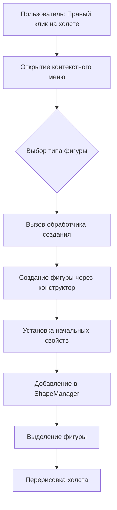
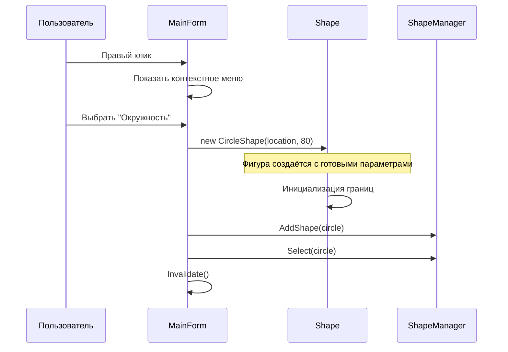
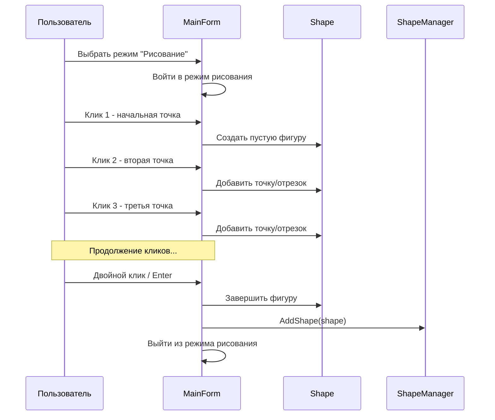

# Анализ архитектуры создания фигур

## 1. Текущий процесс создания фигур

### 1.1 Общая схема создания



### 1.2 Точки входа для создания фигур

Создание фигур инициируется через контекстное меню в [`MainForm.cs`](MainForm.cs:90-115):

```csharp
// Стандартные фигуры
_createShapeMenu.Items.Add("Окружность", null, CreateCircle_Click!);
_createShapeMenu.Items.Add("Прямоугольник", null, CreateRectangle_Click!);
_createShapeMenu.Items.Add("Треугольник", null, CreateTriangle_Click!);
_createShapeMenu.Items.Add("Шестиугольник", null, CreateHexagon_Click!);
_createShapeMenu.Items.Add("Трапеция", null, CreateTrapezoid_Click!);

// Новые фигуры
_createShapeMenu.Items.Add("Многоугольник (PolygonShape)", null, CreatePolygonShape_Click!);
_createShapeMenu.Items.Add("Составная фигура (CompositeShape)", null, CreateCompositeShape_Click!);
```

### 1.3 Примеры обработчиков создания

**Окружность** ([`MainForm.cs:445-455`](MainForm.cs:445)):
```csharp
private void CreateCircle_Click(object? sender, EventArgs e)
{
    var circle = new CircleShape(_menuClickLocation, 80)
    {
        FillColor = Color.LightBlue
    };
    circle.SetBorder(0, 10f, Color.DarkBlue);
    _shapeManager.AddShape(circle);
    _shapeManager.Select(circle);
    Invalidate();
}
```

**Многоугольник** ([`MainForm.cs:516-540`](MainForm.cs:516)):
```csharp
private void CreatePolygonShape_Click(object? sender, EventArgs e)
{
    var polygon = new PolygonShape(_menuClickLocation, new PointF(0, -70))
    {
        FillColor = Color.Lavender,
        IsClosed = true
    };
    
    // Добавляем 5 отрезков для пятиугольника
    polygon.AddSegmentByLengthAngle(82f, 54f);
    polygon.AddSegmentByLengthAngle(82f, 72f);
    // ... ещё 3 отрезка
    
    _shapeManager.AddShape(polygon);
    _shapeManager.Select(polygon);
    Invalidate();
}
```

---

## 2. Анализ существующих конструкторов

### 2.1 Базовый класс ShapeBase

[`Shapes/ShapeBase.cs:114-126`](Shapes/ShapeBase.cs:114):

```csharp
protected ShapeBase()
{
    BorderWidths = new float[6];
    BorderColors = new Color[6];

    for (int i = 0; i < 6; i++)
    {
        BorderWidths[i] = 2f;
        BorderColors[i] = Color.Black;
    }

    FillColor = Color.LightGray;
}
```

**Характеристики:**
- Защищённый конструктор (только для наследников)
- Инициализирует только стили границ и заливку
- **Не устанавливает** `GlobalOrigin`, `LocalAnchor`, `AnchorPos`, `AnchorOffset`
- Требует вызова `UpdateVirtualBounds()` в производных классах

### 2.2 Стандартные фигуры (CircleShape, RectangleShape и др.)

**CircleShape** ([`Shapes/CircleShape.cs:32-40`](Shapes/CircleShape.cs:32)):
```csharp
public CircleShape(Point anchor, int radius)
{
    GlobalOrigin = anchor;
    LocalAnchor = Point.Empty;
    Radius = radius;
    AnchorPos = AnchorPosition.Center;
    AnchorOffset = Point.Empty;
    UpdateVirtualBounds();
}
```

**RectangleShape** ([`Shapes/RectangleShape.cs:20-29`](Shapes/RectangleShape.cs:20)):
```csharp
public RectangleShape(Point anchor, int width, int height)
{
    GlobalOrigin = anchor;
    LocalAnchor = Point.Empty;
    Width = width;
    Height = height;
    AnchorPos = AnchorPosition.Center;
    AnchorOffset = Point.Empty;
    UpdateVirtualBounds();
}
```

**Общий паттерн для стандартных фигур:**
| Параметр | Обязательный | Описание |
|----------|--------------|----------|
| `anchor` | ✅ Да | Точка привязки (GlobalOrigin) |
| Размеры | ✅ Да | Радиус, ширина/высота и т.д. |

**Проблема:** Все стандартные фигуры требуют указания размеров в конструкторе.

### 2.3 PolygonShape - произвольный многоугольник

[`Shapes/PolygonShape.cs:81-106`](Shapes/PolygonShape.cs:81):

```csharp
// Конструктор пустого многоугольника
public PolygonShape(Point anchor, PointF originPoint)
{
    GlobalOrigin = anchor;
    LocalAnchor = Point.Empty;
    OriginPoint = originPoint;
    Segments = new List<LineSegment>();
    IsClosed = true;
    AnchorPos = AnchorPosition.Center;
    AnchorOffset = Point.Empty;
    UpdateVirtualBounds();
}

// Конструктор с предустановленными отрезками
public PolygonShape(Point anchor, PointF originPoint, 
    IEnumerable<LineSegment> segments, bool isClosed = true)
{
    GlobalOrigin = anchor;
    LocalAnchor = Point.Empty;
    OriginPoint = originPoint;
    Segments = segments.Select(s => s.Clone()).ToList();
    IsClosed = isClosed;
    // ...
}
```

**Методы добавления отрезков:**
- [`AddSegmentByLengthAngle(float length, float angleDegrees)`](Shapes/PolygonShape.cs:113) - добавить отрезок
- [`RemoveSegment(int index)`](Shapes/PolygonShape.cs:123) - удалить отрезок
- [`InsertSegment(int index, float length, float angleDegrees)`](Shapes/PolygonShape.cs:136) - вставить отрезок
- [`UpdateSegment(int index, float length, float angleDegrees)`](Shapes/PolygonShape.cs:149) - обновить отрезок
- [`ClearSegments()`](Shapes/PolygonShape.cs:163) - очистить все отрезки

### 2.4 CompositeShape - составная фигура

[`Shapes/CompositeShape.cs:87-102`](Shapes/CompositeShape.cs:87):

```csharp
// Пустой конструктор
public CompositeShape()
{
    AnchorPos = AnchorPosition.Center;
    AnchorOffset = Point.Empty;
}

// Конструктор с начальным списком фигур
public CompositeShape(IEnumerable<ShapeBase> shapes) : this()
{
    foreach (var shape in shapes)
    {
        AddChild(shape);
    }
}
```

**Методы управления дочерними фигурами:**
- [`AddChild(ShapeBase shape)`](Shapes/CompositeShape.cs:107) - добавить фигуру
- [`RemoveChild(ShapeBase shape)`](Shapes/CompositeShape.cs:120) - удалить фигуру
- [`RemoveChildAt(int index)`](Shapes/CompositeShape.cs:136) - удалить по индексу
- [`ClearChildren()`](Shapes/CompositeShape.cs:167) - очистить все

---

## 3. Описание проблемы

### 3.1 Что отсутствует

В текущей архитектуре **нет возможности создавать фигуру "с нуля" интерактивно**:

1. **Нет режима рисования** - пользователь не может кликать на холсте для добавления точек фигуры

2. **Нет пустого конструктора для стандартных фигур** - все требуют размеры:
   - `CircleShape(Point anchor, int radius)` - требует радиус
   - `RectangleShape(Point anchor, int width, int height)` - требует ширину и высоту
   - `TriangleShape(Point anchor, int size)` - требует размер

3. **Нет UI для пошагового построения** - даже PolygonShape создаётся сразу с 5 отрезками

4. **Нет режима "свободного рисования"** - нельзя рисовать мышью как в графическом редакторе

### 3.2 Текущее поведение при создании



### 3.3 Желаемое поведение



---

## 4. Рекомендации по реализации

### 4.1 Вариант 1: Режим рисования для PolygonShape

**Минимальные изменения** - использовать существующий класс PolygonShape:

1. Добавить в [`MainForm`](MainForm.cs) состояние режима рисования:
   ```csharp
   private enum DrawingMode { None, Polygon }
   private DrawingMode _drawingMode = DrawingMode.None;
   private PolygonShape? _drawingShape;
   private List<Point> _drawingPoints = new();
   ```

2. Добавить пункт меню "Рисовать многоугольник"

3. Обрабатывать клики для добавления точек

4. Завершать рисование двойным кликом или Enter

### 4.2 Вариант 2: Новый класс FreeformShape

**Более гибкое решение** - создать новый класс для произвольных фигур:

```csharp
public class FreeformShape : ShapeBase
{
    private List<PointF> _points = new();
    
    // Конструктор с одной начальной точкой
    public FreeformShape(Point startPoint) { ... }
    
    // Добавление точек
    public void AddPoint(Point point) { ... }
    public void InsertPoint(int index, Point point) { ... }
    public void RemovePoint(int index) { ... }
    
    // Завершение фигуры
    public void Close() { ... }
}
```

### 4.3 Вариант 3: Конструктор фигур (Builder Pattern)

**Наиболее масштабируемое решение** - создать отдельный класс-строитель:

```csharp
public class ShapeBuilder
{
    private ShapeBase? _shape;
    private List<Point> _points = new();
    
    public void StartPolygon(Point startPoint) { ... }
    public void AddPoint(Point point) { ... }
    public ShapeBase Complete() { ... }
    public void Cancel() { ... }
}
```

### 4.4 Рекомендуемый подход

**Рекомендуется Вариант 1** как первый этап:

1. **Минимальные изменения в коде** - используется существующий PolygonShape
2. **Быстрая реализация** - не требует новых классов
3. **Пошаговое улучшение** - можно позже расширить

**Этапы реализации:**

| Этап | Задача | Файлы |
|------|--------|-------|
| 1 | Добавить состояние режима рисования в MainForm | `MainForm.cs` |
| 2 | Добавить пункт меню "Рисовать многоугольник" | `MainForm.cs` |
| 3 | Реализовать обработку кликов для добавления точек | `MainForm.cs` |
| 4 | Добавить визуальный feedback (линии между точками) | `MainForm.cs` |
| 5 | Реализовать завершение рисования | `MainForm.cs` |
| 6 | Добавить поддержку клавиш (Esc - отмена, Enter - завершение) | `MainForm.cs` |

---

## 5. Сводная таблица конструкторов

| Класс | Конструктор | Обязательные параметры | Можно создать пустым? |
|-------|-------------|------------------------|----------------------|
| [`ShapeBase`](Shapes/ShapeBase.cs:114) | `protected ShapeBase()` | Нет | ❌ (абстрактный) |
| [`CircleShape`](Shapes/CircleShape.cs:32) | `CircleShape(Point, int)` | anchor, radius | ❌ |
| [`RectangleShape`](Shapes/RectangleShape.cs:20) | `RectangleShape(Point, int, int)` | anchor, width, height | ❌ |
| [`TriangleShape`](Shapes/TriangleShape.cs) | `TriangleShape(Point, int)` | anchor, size | ❌ |
| [`HexagonShape`](Shapes/HexagonShape.cs) | `HexagonShape(Point, int)` | anchor, radius | ❌ |
| [`TrapezoidShape`](Shapes/TrapezoidShape.cs) | `TrapezoidShape(Point, int, int, int)` | anchor, bottom, top, height | ❌ |
| [`PolygonShape`](Shapes/PolygonShape.cs:81) | `PolygonShape(Point, PointF)` | anchor, originPoint | ✅ Да |
| [`CompositeShape`](Shapes/CompositeShape.cs:87) | `CompositeShape()` | Нет | ✅ Да |

---

## 6. Выводы

1. **PolygonShape и CompositeShape** уже поддерживают пошаговое построение через методы `AddSegmentByLengthAngle()` и `AddChild()`

2. **Стандартные фигуры** (CircleShape, RectangleShape и др.) не поддерживают пустое создание - требуют размеры в конструкторе

3. **Отсутствует UI для интерактивного рисования** - нет режима, в котором пользователь мог бы кликать для добавления точек

4. **Рекомендуется** начать с реализации режима рисования для PolygonShape, так как класс уже имеет всю необходимую функциональность
