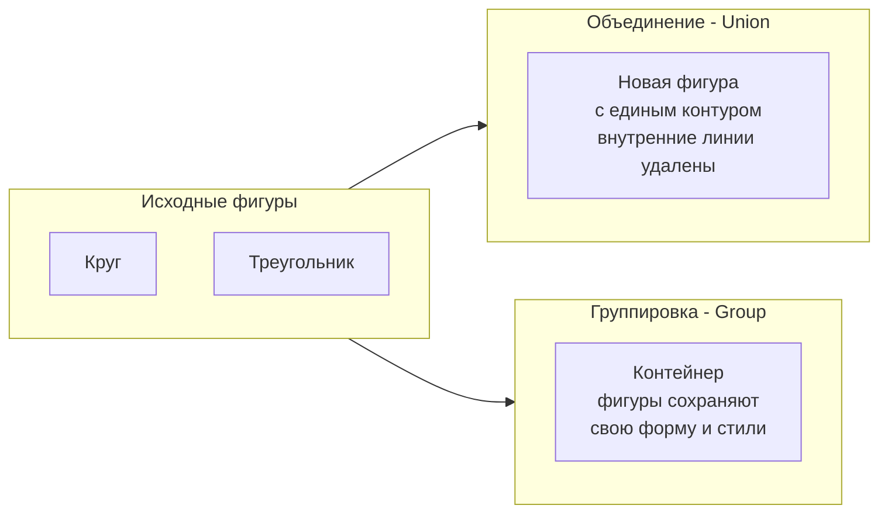
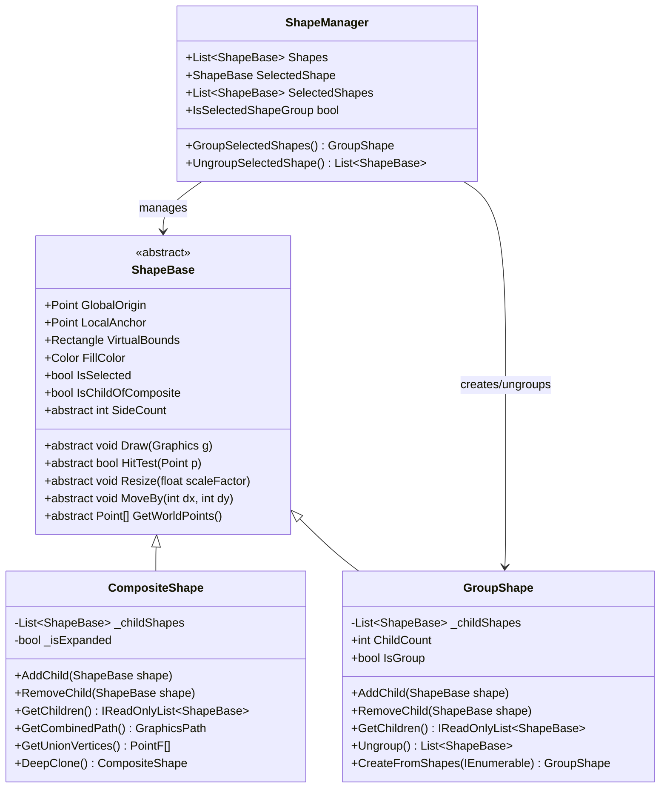

# Анализ: Проектирование механизма группировки фигур

## 1. Краткое описание текущей реализации CompositeShape

### Назначение класса
[`CompositeShape`](Shapes/CompositeShape.cs:13) — класс для объединения нескольких фигур в одну составную фигуру с возможностью создания единого контура через Clipper2.

### Ключевые характеристики

| Аспект | Реализация |
|--------|------------|
| **Хранение дочерних фигур** | `List<ShapeBase> _childShapes` (строка 18) |
| **Режимы отображения** | `IsExpanded` — переключение между отдельными фигурами и объединённым контуром |
| **Объединение контуров** | Через `PolygonConverter.UnionPolygons()` (Clipper2) |
| **Кэширование** | `_cachedPath`, `_cachedHullVertices` для оптимизации |

### Основные методы

```
AddChild(shape)        — добавить дочернюю фигуру
RemoveChild(shape)     — удалить дочернюю фигуру  
GetChildren()          — получить список дочерних фигур
ClearChildren()        — очистить список
GetCombinedPath()      — получить объединённый GraphicsPath
GetUnionVertices()     — получить вершины объединённого контура
DeepClone()            — глубокое клонирование составной фигуры
```

### Переопределённые методы ShapeBase

- [`SideCount`](Shapes/CompositeShape.cs:44) — динамически вычисляется
- [`Draw()`](Shapes/CompositeShape.cs:358) — рисует дочерние фигуры или объединённый контур
- [`HitTest()`](Shapes/CompositeShape.cs:397) — проверяет попадание в любую дочернюю фигуру
- [`Resize()`](Shapes/CompositeShape.cs:443) — масштабирует все дочерние фигуры
- [`MoveBy()`](Shapes/CompositeShape.cs:563) — перемещает все дочерние фигуры
- [`GetWorldPoints()`](Shapes/CompositeShape.cs:310) — возвращает все точки всех фигур

---

## 2. Различия между объединением (Union) и группировкой (Group)



### Сравнительная таблица

| Критерий | Union (Объединение) | Group (Группировка) |
|----------|---------------------|---------------------|
| **Геометрия** | Создаётся новый контур через Clipper2 | Фигуры сохраняют исходную форму |
| **Внутренние линии** | Удаляются | Сохраняются |
| **Заливка** | Единая для всей фигуры | Каждая фигура сохраняет свою заливку |
| **Стили границ** | Единый стиль для всего контура | Каждая фигура сохраняет свои стили |
| **Обратимость** | Необратимая операция | Можно разгруппировать |
| **Редактирование** | Нельзя редактировать исходные фигуры | Можно разгруппировать и редактировать |
| **HitTest** | Попадание в объединённый контур | Попадание в любую дочернюю фигуру |
| **Применение** | Создание сложных форм | Временное объединение для трансформаций |

### Текущее поведение Union в MainForm

Метод [`CombineSelectedShapes_Click()`](MainForm.cs:708):
1. Собирает полигоны из выбранных фигур
2. Выполняет `PolygonConverter.UnionPolygons()` через Clipper2
3. Создаёт **новый PolygonShape** из результата
4. **Удаляет исходные фигуры** из менеджера
5. Добавляет новую объединённую фигуру

---

## 3. Рекомендация: Создать новый класс GroupShape

### Обоснование

**Рекомендуется создать новый класс `GroupShape`**, а не модифицировать `CompositeShape`.

#### Причины:

1. **Разделение ответственности (SRP)**
   - `CompositeShape` — создание новой геометрии из нескольких фигур
   - `GroupShape` — контейнер для совместных трансформаций

2. **Разные жизненные циклы**
   - Union — необратимая операция, создаёт новую фигуру
   - Group — обратимая операция, сохраняет исходные фигуры

3. **Разные операции**
   - Group требует операции `Ungroup()` для восстановления исходных фигур
   - Union не требует разгруппировки

4. **Разные сценарии использования**
   - Union — когда нужно создать сложную форму навсегда
   - Group — когда нужно временно объединить фигуры для перемещения/масштабирования

5. **Простота поддержки**
   - Два специализированных класса проще понимать и поддерживать
   - Избегаем сложной логики переключения режимов

### Альтернатива: Модификация CompositeShape

Если модифицировать `CompositeShape`, потребуется:
- Добавить флаг `_isGroup` для различения режимов
- Разделить логику отрисовки для Group vs Union
- Добавить метод `Ungroup()` с условной логикой
- Усложнить `Draw()`, `HitTest()`, `Resize()` и другие методы

**Вердикт**: Альтернатива приведёт к нарушению принципа единственной ответственности и усложнит код.

---

## 4. Проектирование API для группировки

### 4.1 Класс GroupShape

```csharp
namespace OOTPiSP_LR1.Shapes
{
    /// <summary>
    /// Группа фигур — контейнер для совместных трансформаций.
    /// Фигуры сохраняют свою форму, заливку и стили границ.
    /// Группу можно разгруппировать, восстановив исходные фигуры.
    /// </summary>
    public class GroupShape : ShapeBase
    {
        private readonly List<ShapeBase> _childShapes = new();
        
        #region Свойства
        
        /// <summary>
        /// Количество дочерних фигур в группе
        /// </summary>
        public int ChildCount => _childShapes.Count;
        
        /// <summary>
        /// Признак того, что фигура является группой
        /// </summary>
        public bool IsGroup => true;
        
        /// <summary>
        /// Количество сторон — сумма сторон всех дочерних фигур
        /// </summary>
        public override int SideCount => _childShapes.Sum(s => s.SideCount);
        
        #endregion
        
        #region Управление дочерними фигурами
        
        /// <summary>
        /// Добавить фигуру в группу
        /// </summary>
        public void AddChild(ShapeBase shape);
        
        /// <summary>
        /// Удалить фигуру из группы
        /// </summary>
        public bool RemoveChild(ShapeBase shape);
        
        /// <summary>
        /// Получить список дочерних фигур (только для чтения)
        /// </summary>
        public IReadOnlyList<ShapeBase> GetChildren();
        
        /// <summary>
        /// Получить дочернюю фигуру по индексу
        /// </summary>
        public ShapeBase? GetChild(int index);
        
        #endregion
        
        #region Операции группы
        
        /// <summary>
        /// Разгруппировать — вернуть все дочерние фигуры.
        /// Возвращает список фигур для добавления в ShapeManager.
        /// </summary>
        public List<ShapeBase> Ungroup();
        
        /// <summary>
        /// Создать группу из списка фигур
        /// </summary>
        public static GroupShape CreateFromShapes(IEnumerable<ShapeBase> shapes);
        
        #endregion
        
        #region Переопределение ShapeBase
        
        public override void Draw(Graphics g);
        public override bool HitTest(Point p);
        public override void Resize(float scaleFactor);
        public override void ResizeSide(int sideIndex, float scaleFactor);
        public override float GetSideLength(int sideIndex);
        public override void SetSideLength(int sideIndex, float length);
        public override void MoveBy(int dx, int dy);
        public override void MoveTo(Point location);
        public override Point[] GetWorldPoints();
        protected override Point CalculateAnchorOffset(AnchorPosition position);
        protected override void UpdateVirtualBounds();
        public override void ResetDeformation();
        
        #endregion
    }
}
```

### 4.2 Методы ShapeManager

```csharp
// В класс ShapeManager добавить:

/// <summary>
/// Сгруппировать выбранные фигуры
/// </summary>
/// <returns>Созданная группа или null</returns>
public GroupShape? GroupSelectedShapes()
{
    if (SelectedShapes.Count < 2) return null;
    
    var group = GroupShape.CreateFromShapes(SelectedShapes);
    
    // Удаляем исходные фигуры
    foreach (var shape in SelectedShapes)
        Shapes.Remove(shape);
    
    // Добавляем группу
    Shapes.Add(group);
    
    // Выбираем группу
    SelectSingle(group);
    
    return group;
}

/// <summary>
/// Разгруппировать выбранную фигуру
/// </summary>
/// <returns>Список фигур после разгруппировки или null</returns>
public List<ShapeBase>? UngroupSelectedShape()
{
    if (SelectedShape is not GroupShape group) return null;
    
    var children = group.Ungroup();
    
    // Удаляем группу
    Shapes.Remove(group);
    
    // Добавляем дочерние фигуры
    foreach (var child in children)
        Shapes.Add(child);
    
    // Снимаем выделение
    ClearSelection();
    
    return children;
}

/// <summary>
/// Проверить, является ли выбранная фигура группой
/// </summary>
public bool IsSelectedShapeGroup => SelectedShape is GroupShape;
```

### 4.3 Методы MainForm

```csharp
/// <summary>
/// Сгруппировать выбранные фигуры (Ctrl+G)
/// </summary>
private void GroupShapes_Click(object? sender, EventArgs e)
{
    if (_shapeManager.SelectedShapes.Count < 2)
    {
        MessageBox.Show(
            "Выберите минимум 2 фигуры для группировки (Ctrl+клик)",
            "Группировка фигур",
            MessageBoxButtons.OK,
            MessageBoxIcon.Information);
        return;
    }
    
    var group = _shapeManager.GroupSelectedShapes();
    
    if (group != null)
    {
        if (_propertiesPanelVisible)
            _propertiesPanel.SetShape(group);
        Invalidate();
    }
}

/// <summary>
/// Разгруппировать выбранную фигуру (Ctrl+Shift+G)
/// </summary>
private void UngroupShapes_Click(object? sender, EventArgs e)
{
    if (!_shapeManager.IsSelectedShapeGroup)
    {
        MessageBox.Show(
            "Выбранная фигура не является группой",
            "Разгруппировка",
            MessageBoxButtons.OK,
            MessageBoxIcon.Information);
        return;
    }
    
    var children = _shapeManager.UngroupSelectedShape();
    
    if (children != null)
    {
        if (_propertiesPanelVisible)
            _propertiesPanel.SetShape(null);
        Invalidate();
    }
}
```

---

## 5. Методы ShapeBase для переопределения

### Обязательные для переопределения (abstract)

| Метод | Реализация в GroupShape |
|-------|-------------------------|
| [`SideCount`](Shapes/ShapeBase.cs:159) | Сумма сторон всех дочерних фигур |
| [`CalculateAnchorOffset()`](Shapes/ShapeBase.cs:235) | На основе общих границ группы |
| [`UpdateVirtualBounds()`](Shapes/ShapeBase.cs:248) | Охватывающий прямоугольник всех фигур |
| [`GetWorldPoints()`](Shapes/ShapeBase.cs:382) | Все точки всех дочерних фигур |
| [`Draw()`](Shapes/ShapeBase.cs:426) | Отрисовка всех дочерних фигур |
| [`HitTest()`](Shapes/ShapeBase.cs:431) | Попадание в любую дочернюю фигуру |
| [`Resize()`](Shapes/ShapeBase.cs:437) | Масштабирование всех фигур относительно центра группы |
| [`ResizeSide()`](Shapes/ShapeBase.cs:444) | Не применимо к группе — выбросить исключение или no-op |
| [`GetSideLength()`](Shapes/ShapeBase.cs:449) | Делегировать соответствующей дочерней фигуре |
| [`SetSideLength()`](Shapes/ShapeBase.cs:456) | Делегировать соответствующей дочерней фигуре |

### Виртуальные методы (virtual) — рекомендуется переопределить

| Метод | Реализация в GroupShape |
|-------|-------------------------|
| [`MoveBy()`](Shapes/ShapeBase.cs:546) | Перемещение всех дочерних фигур |
| [`MoveTo()`](Shapes/ShapeBase.cs:556) | Перемещение всех фигур с сохранением относительных позиций |
| [`ResetDeformation()`](Shapes/ShapeBase.cs:417) | Сброс деформации всех дочерних фигур |
| [`GetAngle()`](Shapes/ShapeBase.cs:463) | Делегировать первой дочерней фигуре |
| [`SetAngle()`](Shapes/ShapeBase.cs:494) | Не применимо к группе или применять ко всем |

---

## 6. Предложения по UI

### 6.1 Горячие клавиши

| Комбинация | Действие |
|------------|----------|
| **Ctrl+G** | Сгруппировать выбранные фигуры |
| **Ctrl+Shift+G** | Разгруппировать выбранную группу |
| **Ctrl+U** | Альтернатива для разгруппировки (как в Adobe) |

### 6.2 Контекстное меню (правый клик)

```
┌─────────────────────────────────┐
│ Сгруппировать          Ctrl+G   │ ← доступно при 2+ выбранных фигурах
│ Разгруппировать    Ctrl+Shift+G │ ← доступно при выборе группы
│─────────────────────────────────│
│ Объединить в фигуру             │ ← существующий Union
│─────────────────────────────────│
│ Вырезать                    Ctrl+X   │
│ Копировать                  Ctrl+C   │
│ Удалить                     Del      │
└─────────────────────────────────┘
```

### 6.3 Главное меню

Добавить в меню **Правка** (Edit):

```
Правка
├── Отменить                    Ctrl+Z
├── Повторить                   Ctrl+Y
├───────────────────────────────
├── Сгруппировать               Ctrl+G      ← НОВОЕ
├── Разгруппировать             Ctrl+Shift+G ← НОВОЕ
├── Объединить в фигуру                     ← Существующее
├───────────────────────────────
├── Копировать                  Ctrl+C
├── Вставить                    Ctrl+V
├── Удалить                     Del
```

### 6.4 Панель инструментов (опционально)

Добавить кнопки:
- 📦 **Группировать** — иконка с несколькими объектами в рамке
- 📤 **Разгруппировать** — иконка с объектами, выходящими из рамки

### 6.5 Визуальная индикация

- При выборе группы показывать пунктирную рамку вокруг всех дочерних фигур
- В панели свойств показывать тип фигуры как "Группа (N объектов)"
- Добавить индикатор в дереве объектов (если есть)

---

## 7. Диаграмма классов



---

## 8. План реализации

### Этап 1: Создание класса GroupShape
- [ ] Создать файл `Shapes/GroupShape.cs`
- [ ] Реализовать базовую структуру класса
- [ ] Реализовать управление дочерними фигурами
- [ ] Переопределить все абстрактные методы ShapeBase

### Этап 2: Интеграция с ShapeManager
- [ ] Добавить метод `GroupSelectedShapes()`
- [ ] Добавить метод `UngroupSelectedShape()`
- [ ] Добавить свойство `IsSelectedShapeGroup`

### Этап 3: UI в MainForm
- [ ] Добавить обработчики `GroupShapes_Click` и `UngroupShapes_Click`
- [ ] Добавить пункты меню
- [ ] Настроить горячие клавиши
- [ ] Добавить контекстное меню

### Этап 4: Интеграция с PropertiesPanel
- [ ] Добавить отображение информации о группе
- [ ] Показывать количество дочерних фигур
- [ ] Блокировать редактирование свойств, не применимых к группе

### Этап 5: Тестирование
- [ ] Проверить группировку 2+ фигур
- [ ] Проверить разгруппировку
- [ ] Проверить перемещение группы
- [ ] Проверить масштабирование группы
- [ ] Проверить HitTest для группы
- [ ] Проверить вложенные группы (группа в группе)

---

## 9. Риски и ограничения

### Риски

1. **Вложенные группы** — группа внутри группы может усложнить логику разгруппировки
2. **Производительность** — при большом количестве фигур в группе может замедлиться отрисовка
3. **Сериализация** — если потребуется сохранение/загрузка, нужно учесть Groups

### Ограничения

1. **ResizeSide()** — не применимо к группе, выбрасывает `NotSupportedException`
2. **SetSideLength()** — работает только для сторон конкретных дочерних фигур
3. **Общий FillColor** — группа не имеет собственной заливки, каждая фигура сохраняет свою

---

## 10. Итоговый вывод

**Рекомендуется создать новый класс `GroupShape`**, который:

1. Наследуется от `ShapeBase`
2. Хранит список дочерних фигур без изменения их геометрии
3. Обеспечивает совместные трансформации (перемещение, масштабирование)
4. Поддерживает операцию разгруппировки с восстановлением исходных фигур
5. Интегрируется с существующим `ShapeManager` и `MainForm`

Это решение следует принципам SOLID, сохраняет обратную совместимость и обеспечивает чистое разделение ответственности между объединением (создание новой геометрии) и группировкой (контейнер для трансформаций).
