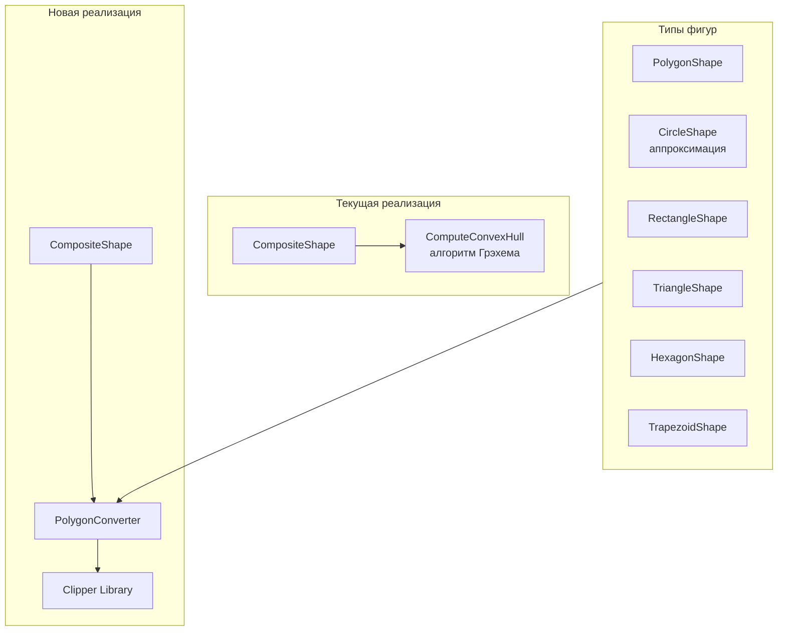
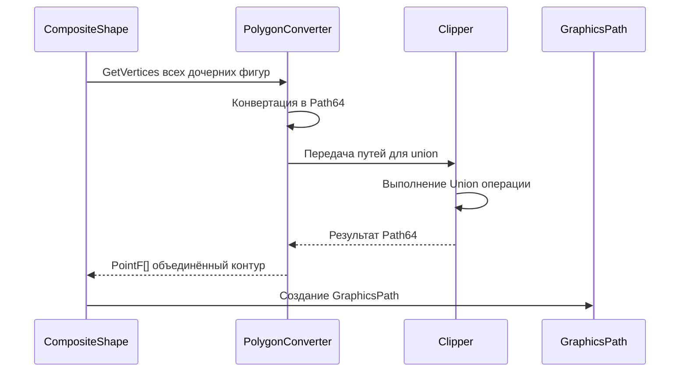

# Проектирование: Объединение фигур с единым контуром

## Проблема

При объединении нескольких фигур в `CompositeShape` текущая реализация использует **выпуклую оболочку (Convex Hull)**, которая:
- Работает только для выпуклых форм
- "Выпрямляет" вогнутые участки
- Теряет форму исходных фигур при сложных объединениях

## Выбранное решение: Clipper Library

### Обоснование выбора

| Критерий | Clipper Library | Convex Hull | Свой алгоритм |
|----------|-----------------|-------------|---------------|
| Точность | ✅ Высокая | ❌ Только выпуклые | ✅ Высокая |
| Сложность реализации | ✅ Низкая (библиотека) | ✅ Уже готово | ❌ Высокая |
| Поддержка вогнутых форм | ✅ Да | ❌ Нет | ✅ Да |
| Внешние зависимости | ⚠️ NuGet-пакет | ✅ Нет | ✅ Нет |
| Поддержка отверстий | ✅ Да | ❌ Нет | ⚠️ Сложно |

### О библиотеке Clipper

**Clipper2** — современная версия популярной библиотеки для операций с полигонами:
- NuGet-пакет: `Clipper2`
- Поддерживаемые операции: Union, Intersection, Difference, XOR
- Поддержка: простые и сложные полигоны, отверстия, самопересечения
- Производительность: O(n log n)

## Архитектура решения

### Диаграмма компонентов



### Поток данных при объединении



## Изменения в коде

### 1. Файл проекта: `ООТПиСП ЛР1.csproj`

**Добавить NuGet-зависимость:**
```xml
<ItemGroup>
  <PackageReference Include="Clipper2" Version="1.4.0" />
</ItemGroup>
```

### 2. Новый файл: `Shapes/PolygonConverter.cs`

**Назначение:** Конвертация между форматами фигур и Clipper

```csharp
using Clipper2Lib;

namespace OOTPiSP_LR1.Shapes
{
    /// <summary>
    /// Конвертер между фигурами и форматом Clipper
    /// </summary>
    public static class PolygonConverter
    {
        // Масштаб для конвертации float в long (Clipper использует целые)
        private const long SCALE = 1000;
        
        /// <summary>
        /// Конвертировать PointF[] в Path64
        /// </summary>
        public static Path64 ToPath64(PointF[] points)
        {
            var path = new Path64();
            foreach (var p in points)
            {
                path.Add(new Point64(
                    (long)(p.X * SCALE),
                    (long)(p.Y * SCALE)
                ));
            }
            return path;
        }
        
        /// <summary>
        /// Конвертировать Path64 в PointF[]
        /// </summary>
        public static PointF[] ToPointF(Path64 path)
        {
            var points = new PointF[path.Count];
            for (int i = 0; i < path.Count; i++)
            {
                points[i] = new PointF(
                    path[i].X / (float)SCALE,
                    path[i].Y / (float)SCALE
                );
            }
            return points;
        }
        
        /// <summary>
        /// Выполнить union нескольких полигонов
        /// </summary>
        public static Paths64 Union(IEnumerable<Path64> paths)
        {
            var clipper = new Clipper64();
            clipper.AddSubject(paths);
            
            var solution = new Paths64();
            clipper.Execute(ClipType.Union, FillRule.NonZero, solution);
            
            return solution;
        }
        
        /// <summary>
        /// Аппроксимация окружности в полигон
        /// </summary>
        public static PointF[] CircleToPolygon(PointF center, float radius, int segments = 32)
        {
            var points = new PointF[segments];
            for (int i = 0; i < segments; i++)
            {
                float angle = 2 * MathF.PI * i / segments;
                points[i] = new PointF(
                    center.X + radius * MathF.Cos(angle),
                    center.Y + radius * MathF.Sin(angle)
                );
            }
            return points;
        }
    }
}
```

### 3. Изменения в: `Shapes/CompositeShape.cs`

**Заменить методы:**

#### 3.1 Заменить `RecalculateCombinedPath()`

```csharp
private void RecalculateCombinedPath()
{
    _cachedPath?.Dispose();
    _cachedPath = new GraphicsPath();

    if (_childShapes.Count == 0)
    {
        _needsRecalculation = false;
        return;
    }

    // Собираем все полигоны дочерних фигур
    var paths = new List<Path64>();
    
    foreach (var child in _childShapes)
    {
        var vertices = child.GetVertices();
        if (vertices.Length >= 3)
        {
            // Специальная обработка для окружностей
            if (child is CircleShape circle)
            {
                var circleVertices = PolygonConverter.CircleToPolygon(
                    new PointF(circle.WorldPosition.X, circle.WorldPosition.Y),
                    circle.Radius
                );
                paths.Add(PolygonConverter.ToPath64(circleVertices));
            }
            else
            {
                paths.Add(PolygonConverter.ToPath64(vertices));
            }
        }
    }

    if (paths.Count == 0)
    {
        _needsRecalculation = false;
        return;
    }

    // Выполняем union через Clipper
    var unionResult = PolygonConverter.Union(paths);
    
    // Создаем GraphicsPath из результата
    foreach (var path in unionResult)
    {
        var points = PolygonConverter.ToPointF(path);
        if (points.Length >= 3)
        {
            _cachedPath.AddPolygon(points);
        }
    }

    _needsRecalculation = false;
}
```

#### 3.2 Заменить `ComputeUnionVertices()`

```csharp
private PointF[] ComputeUnionVertices()
{
    if (_childShapes.Count == 0)
        return Array.Empty<PointF>();

    // Собираем все полигоны
    var paths = new List<Path64>();
    
    foreach (var child in _childShapes)
    {
        var vertices = child.GetVertices();
        if (vertices.Length >= 3)
        {
            if (child is CircleShape circle)
            {
                var circleVertices = PolygonConverter.CircleToPolygon(
                    new PointF(circle.WorldPosition.X, circle.WorldPosition.Y),
                    circle.Radius
                );
                paths.Add(PolygonConverter.ToPath64(circleVertices));
            }
            else
            {
                paths.Add(PolygonConverter.ToPath64(vertices));
            }
        }
    }

    if (paths.Count == 0)
        return Array.Empty<PointF>();

    // Выполняем union
    var unionResult = PolygonConverter.Union(paths);
    
    // Возвращаем первый (внешний) контур
    if (unionResult.Count > 0)
    {
        return PolygonConverter.ToPointF(unionResult[0]);
    }
    
    return Array.Empty<PointF>();
}
```

#### 3.3 Удалить или сохранить `ComputeConvexHull()`

Метод можно сохранить как fallback или альтернативный режим.

### 4. Обработка сложных случаев

#### Многосвязные области (отверстия)

Если результат union содержит несколько контуров (например, отверстия):

```csharp
public PointF[][] GetUnionPathsWithHoles()
{
    var paths = CollectChildPaths();
    var unionResult = PolygonConverter.Union(paths);
    
    var result = new PointF[unionResult.Count][];
    for (int i = 0; i < unionResult.Count; i++)
    {
        result[i] = PolygonConverter.ToPointF(unionResult[i]);
    }
    return result;
}
```

## План реализации

### Этап 1: Подключение зависимости
- [ ] Добавить NuGet-пакет `Clipper2` в проект
- [ ] Проверить сборку проекта

### Этап 2: Создание конвертера
- [ ] Создать файл `Shapes/PolygonConverter.cs`
- [ ] Реализовать методы конвертации
- [ ] Добавить метод аппроксимации окружности

### Этап 3: Интеграция в CompositeShape
- [ ] Обновить метод `RecalculateCombinedPath()`
- [ ] Обновить метод `ComputeUnionVertices()`
- [ ] Добавить обработку CircleShape

### Этап 4: Тестирование
- [ ] Проверить объединение двух треугольников
- [ ] Проверить объединение с окружностью
- [ ] Проверить сложные случаи (L-образные формы)
- [ ] Проверить HitTest для объединённой фигуры

## Риски и ограничения

1. **Производительность**: Clipper работает с целочисленными координатами, требуется масштабирование
2. **Точность**: При масштабировании возможна небольшая потеря точности (пренебрежимо мала при SCALE=1000)
3. **Сложные случаи**: Самопересекающиеся полигоны требуют специальной обработки

## Альтернативы

Если Clipper2 не подойдёт, можно рассмотреть:
- **Clipper1** — старая версия, более известная
- **Poly2Tri** — триангуляция, затем объединение
- **Box2D** — физический движок с поддержкой полигонов
