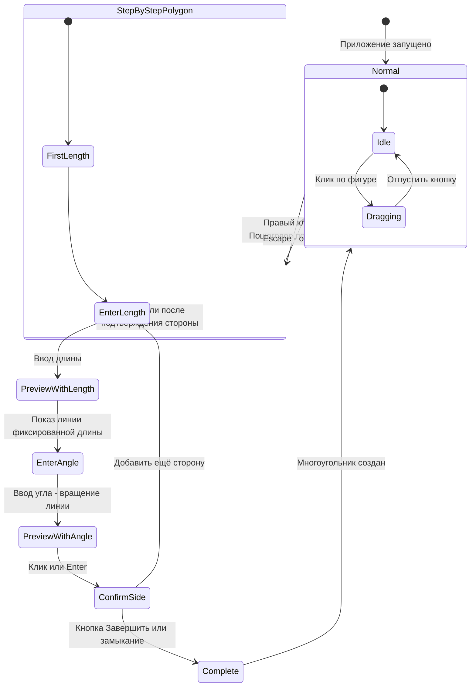
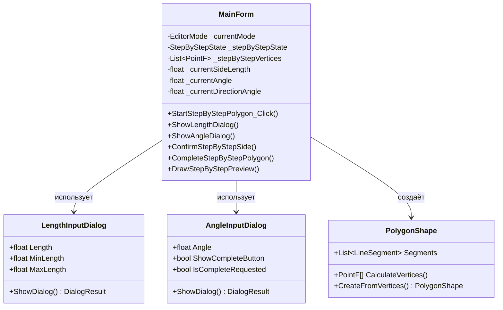

# План реализации пошагового построения многоугольника

## 1. Обзор задачи

### 1.1 Цель
Реализовать новый режим построения n-угольника, где пользователь пошагово задаёт:
1. Длину первой стороны
2. Внутренний угол между первой и второй стороной
3. Длину второй стороны
4. Внутренний угол между второй и третьей стороной
5. И так далее до завершения построения

### 1.2 Ключевые требования
- **Ввод данных**: через диалоговые окна
- **Preview**: после ввода длины показывать линию, которая вращается при вводе угла
- **Тип угла**: внутренний угол (угол поворота внутрь многоугольника)
- **Завершение**: кнопка "Завершить" в диалоге или замыкание на первую точку
- **Замыкание**: последняя и начальная точка должны соединиться автоматически

---

## 2. Диаграмма состояний



---

## 3. Архитектура решения

### 3.1 Новые классы

#### 3.1.1 LengthInputDialog
Диалог для ввода длины стороны.

```
+---------------------------+
|  Ввод длины стороны       |
+---------------------------+
|                           |
|  Длина: [____100___] px   |
|                           |
|  [Отмена]    [OK]         |
+---------------------------+
```

**Свойства:**
- `Length` - введённая длина (float)
- `MinLength` - минимальная длина (по умолчанию 1)
- `MaxLength` - максимальная длина (по умолчанию 1000)

#### 3.1.2 AngleInputDialog
Диалог для ввода внутреннего угла.

```
+---------------------------+
|  Ввод внутреннего угла    |
+---------------------------+
|                           |
|  Угол: [____60____] °     |
|                           |
|  [Завершить]  [Отмена] [OK]|
+---------------------------+
```

**Свойства:**
- `Angle` - введённый угол (float)
- `ShowCompleteButton` - показывать ли кнопку "Завершить"
- `IsCompleteRequested` - нажата ли кнопка "Завершить"

### 3.2 Изменения в MainForm

#### 3.2.1 Новые поля

```csharp
// === Режим пошагового построения многоугольника ===

/// <summary>
/// Режим работы редактора
/// </summary>
private enum EditorMode
{
    Normal,              // Обычный режим
    DrawingPolygon,      // Рисование многоугольника (существующий)
    StepByStepPolygon    // Пошаговое построение (новый)
}

private EditorMode _currentMode = EditorMode.Normal;

/// <summary>
/// Состояние внутри режима пошагового построения
/// </summary>
private enum StepByStepState
{
    EnterLength,      // Ожидание ввода длины
    PreviewLength,    // Preview линии после ввода длины
    EnterAngle,       // Ожидание ввода угла (с preview)
    ConfirmSide       // Подтверждение стороны
}

private StepByStepState _stepByStepState;

/// <summary>
/// Текущая длина вводимой стороны
/// </summary>
private float _currentSideLength;

/// <summary>
/// Текущий вводимый угол
/// </summary>
private float _currentAngle;

/// <summary>
/// Список вершин построенного многоугольника
/// </summary>
private List<PointF> _stepByStepVertices;

/// <summary>
/// Текущее направление (угол) последней стороны
/// </summary>
private float _currentDirectionAngle;

/// <summary>
/// Начальная точка построения
/// </summary>
private PointF _stepByStepOrigin;
```

---

## 4. Алгоритм построения

### 4.1 Вычисление следующей вершины

При построении используется **внутренний угол** - угол поворота внутрь многоугольника.

```
Текущее направление: currentDirectionAngle (в градусах, 0 = вправо)
Внутренний угол: interiorAngle (в градусах)

Новое направление = currentDirectionAngle + 180 - interiorAngle
```

**Пример для равностороннего треугольника:**
- Начальное направление: 0° (вправо)
- Длина стороны: 100
- Внутренний угол: 60°

```
Вершина 0: (0, 0)
Вершина 1: (100, 0)  // 100 пикселей вправо
Направление после поворота: 0 + 180 - 60 = 120°
Вершина 2: (100 + 100*cos(120°), 0 + 100*sin(120°)) = (50, 86.6)
Направление после поворота: 120 + 180 - 60 = 240°
Вершина 3: должна совпасть с вершиной 0
```

### 4.2 Код вычисления

```csharp
/// <summary>
/// Вычислить следующую вершину на основе текущей позиции, направления и внутреннего угла
/// </summary>
private PointF CalculateNextVertex(PointF current, float currentDirection, 
                                    float sideLength, float interiorAngle)
{
    // Новое направление = текущее + разворот - внутренний угол
    float newDirection = currentDirection + 180 - interiorAngle;
    float radians = newDirection * (float)Math.PI / 180;
    
    return new PointF(
        current.X + sideLength * (float)Math.Cos(radians),
        current.Y + sideLength * (float)Math.Sin(radians)
    );
}
```

---

## 5. Поток взаимодействия с пользователем

### 5.1 Первый вход в режим

```
1. Пользователь: Правый клик -> "Пошаговое построение многоугольника"
2. Система: Показывает диалог ввода длины первой стороны
3. Пользователь: Вводит длину (например, 100)
4. Система: Показывает preview первой стороны от начальной точки
5. Система: Показывает диалог ввода угла
6. Пользователь: Вводит угол (например, 60°)
7. Система: Обновляет preview - линия поворачивается на угол
8. Пользователь: Клик/Enter для подтверждения стороны
```

### 5.2 Последующие стороны

```
1. Система: Показывает диалог ввода длины следующей стороны
2. Пользователь: Вводит длину
3. Система: Показывает preview следующей стороны от последней вершины
4. Система: Показывает диалог ввода угла
5. Пользователь: Вводит угол или нажимает "Завершить"
6. Если "Завершить":
   - Система замыкает многоугольник (соединяет с первой точкой)
   - Создаётся PolygonShape
7. Иначе:
   - Система обновляет preview
   - Пользователь подтверждает сторону
   - Переход к п.1
```

### 5.3 Автоматическое замыкание

Если при подтверждении стороны новая вершина оказывается близко к начальной (радиус ~15 пикселей), автоматически замыкаем многоугольник.

---

## 6. Визуальный Feedback

### 6.1 Отрисовка preview

```csharp
/// <summary>
/// Нарисовать preview пошагового построения
/// </summary>
private void DrawStepByStepPreview(Graphics g)
{
    // 1. Рисуем уже построенные стороны
    if (_stepByStepVertices.Count >= 2)
    {
        using (var pen = new Pen(Color.DodgerBlue, 2f))
        {
            for (int i = 0; i < _stepByStepVertices.Count - 1; i++)
            {
                g.DrawLine(pen, _stepByStepVertices[i], _stepByStepVertices[i + 1]);
            }
        }
    }
    
    // 2. Рисуем вершины
    DrawStepByStepVertices(g);
    
    // 3. Рисуем preview текущей стороны
    if (_stepByStepState == StepByStepState.PreviewLength || 
        _stepByStepState == StepByStepState.EnterAngle)
    {
        var lastVertex = _stepByStepVertices[_stepByStepVertices.Count - 1];
        var previewEnd = CalculatePreviewEndpoint();
        
        using (var pen = new Pen(Color.Orange, 2f))
        {
            pen.DashStyle = DashStyle.Dash;
            g.DrawLine(pen, lastVertex, previewEnd);
        }
        
        // Preview замыкающей линии (если 3+ вершин)
        if (_stepByStepVertices.Count >= 3)
        {
            using (var pen = new Pen(Color.LightGray, 1f))
            {
                pen.DashStyle = DashStyle.Dot;
                g.DrawLine(pen, previewEnd, _stepByStepVertices[0]);
            }
        }
    }
    
    // 4. Индикатор режима
    DrawStepByStepIndicator(g);
}
```

### 6.2 Индикатор режима

```
+------------------------------------------------------------------+
|  ПОШАГОВОЕ ПОСТРОЕНИЕ | Сторона: 3 | Длина: 100 | Угол: 60°      |
|  Клик/Enter - подтвердить | Esc - отмена | Замкнуть на первую   |
+------------------------------------------------------------------+
```

---

## 7. Детальный план реализации

### 7.1 Создать LengthInputDialog.cs

**Файл:** `Dialogs/LengthInputDialog.cs`

```csharp
namespace OOTPiSP_LR1.Dialogs
{
    public class LengthInputDialog : Form
    {
        private NumericUpDown _lengthNumericUpDown;
        private Button _okButton;
        private Button _cancelButton;
        
        public float Length 
        { 
            get => (float)_lengthNumericUpDown.Value;
            set => _lengthNumericUpDown.Value = (decimal)value;
        }
        
        public float MinLength 
        { 
            set => _lengthNumericUpDown.Minimum = (decimal)value;
        }
        
        public float MaxLength 
        { 
            set => _lengthNumericUpDown.Maximum = (decimal)value;
        }
        
        public LengthInputDialog(float defaultLength = 100f)
        {
            // Инициализация компонентов...
        }
    }
}
```

### 7.2 Создать AngleInputDialog.cs

**Файл:** `Dialogs/AngleInputDialog.cs`

```csharp
namespace OOTPiSP_LR1.Dialogs
{
    public class AngleInputDialog : Form
    {
        private NumericUpDown _angleNumericUpDown;
        private Button _okButton;
        private Button _cancelButton;
        private Button _completeButton;
        
        public float Angle 
        { 
            get => (float)_angleNumericUpDown.Value;
            set => _angleNumericUpDown.Value = (decimal)value;
        }
        
        public bool ShowCompleteButton 
        { 
            get => _completeButton.Visible;
            set => _completeButton.Visible = value;
        }
        
        public bool IsCompleteRequested { get; private set; }
        
        public AngleInputDialog(float defaultAngle = 90f, bool showComplete = false)
        {
            // Инициализация компонентов...
        }
    }
}
```

### 7.3 Изменения в MainForm.cs

#### Добавить enum EditorMode

```csharp
/// <summary>
/// Режим работы редактора
/// </summary>
private enum EditorMode
{
    Normal,              // Обычный режим
    DrawingPolygon,      // Рисование многоугольника
    StepByStepPolygon    // Пошаговое построение
}
```

#### Добавить поля для пошагового построения

```csharp
// === Пошаговое построение многоугольника ===
private EditorMode _currentMode = EditorMode.Normal;
private StepByStepState _stepByStepState;
private float _currentSideLength;
private float _currentAngle;
private List<PointF> _stepByStepVertices = new();
private float _currentDirectionAngle;
private PointF _stepByStepOrigin;
```

#### Добавить пункт меню

В методе `SetupCreateShapeMenu()`:

```csharp
// После существующего пункта "Рисовать многоугольник"
_createShapeMenu.Items.Add("Пошаговое построение многоугольника", null, StartStepByStepPolygon_Click!);
```

#### Реализовать методы обработчики

```csharp
private void StartStepByStepPolygon_Click(object? sender, EventArgs e)
{
    _currentMode = EditorMode.StepByStepPolygon;
    _stepByStepState = StepByStepState.EnterLength;
    _stepByStepVertices.Clear();
    _stepByStepOrigin = _menuClickLocation;
    _stepByStepVertices.Add(_stepByStepOrigin);
    _currentDirectionAngle = 0; // Начальное направление - вправо
    
    // Показываем диалог ввода длины
    ShowLengthDialog();
}

private void ShowLengthDialog()
{
    using var dialog = new LengthInputDialog(100f);
    if (dialog.ShowDialog() == DialogResult.OK)
    {
        _currentSideLength = dialog.Length;
        _stepByStepState = StepByStepState.PreviewLength;
        Invalidate();
        
        // Показываем диалог ввода угла
        ShowAngleDialog();
    }
    else
    {
        // Отмена
        CancelStepByStep();
    }
}

private void ShowAngleDialog()
{
    bool showComplete = _stepByStepVertices.Count >= 3;
    using var dialog = new AngleInputDialog(90f, showComplete);
    
    var result = dialog.ShowDialog();
    
    if (result == DialogResult.OK)
    {
        _currentAngle = dialog.Angle;
        _stepByStepState = StepByStepState.EnterAngle;
        Invalidate();
    }
    else if (dialog.IsCompleteRequested)
    {
        CompleteStepByStepPolygon();
    }
    else
    {
        // Отмена - возвращаемся к вводу длины
        _stepByStepState = StepByStepState.EnterLength;
        ShowLengthDialog();
    }
}

private void ConfirmStepByStepSide()
{
    // Вычисляем новую вершину
    var lastVertex = _stepByStepVertices[_stepByStepVertices.Count - 1];
    var newVertex = CalculateNextVertex(lastVertex, _currentDirectionAngle, 
                                         _currentSideLength, _currentAngle);
    
    // Проверяем замыкание
    if (_stepByStepVertices.Count >= 3)
    {
        float distance = DistanceBetween(newVertex, _stepByStepVertices[0]);
        if (distance < 15f)
        {
            CompleteStepByStepPolygon();
            return;
        }
    }
    
    // Добавляем вершину
    _stepByStepVertices.Add(newVertex);
    
    // Обновляем направление
    _currentDirectionAngle = _currentDirectionAngle + 180 - _currentAngle;
    
    // Запускаем ввод следующей стороны
    _stepByStepState = StepByStepState.EnterLength;
    ShowLengthDialog();
}

private void CompleteStepByStepPolygon()
{
    if (_stepByStepVertices.Count < 3)
    {
        CancelStepByStep();
        return;
    }
    
    // Создаём многоугольник
    var polygon = PolygonShape.CreateFromVertices(_stepByStepVertices.ToArray(), true);
    polygon.FillColor = Color.LightYellow;
    
    _shapeManager.AddShape(polygon);
    _shapeManager.Select(polygon);
    
    ResetStepByStep();
    Invalidate();
}

private void CancelStepByStep()
{
    ResetStepByStep();
    Invalidate();
}

private void ResetStepByStep()
{
    _currentMode = EditorMode.Normal;
    _stepByStepState = StepByStepState.EnterLength;
    _stepByStepVertices.Clear();
    Cursor = Cursors.Default;
}
```

---

## 8. Интеграция с существующим кодом

### 8.1 Изменения в MainForm_Paint

```csharp
private void MainForm_Paint(object? sender, PaintEventArgs e)
{
    e.Graphics.SmoothingMode = SmoothingMode.AntiAlias;
    
    DrawCanvasArea(e.Graphics);
    _shapeManager.DrawAll(e.Graphics);
    
    // Существующий режим рисования
    if (_isDrawingMode)
    {
        DrawPolygonPreview(e.Graphics);
        DrawDrawingModeIndicator(e.Graphics);
    }
    
    // Новый режим пошагового построения
    if (_currentMode == EditorMode.StepByStepPolygon)
    {
        DrawStepByStepPreview(e.Graphics);
        DrawStepByStepIndicator(e.Graphics);
    }
}
```

### 8.2 Изменения в MainForm_MouseDown

```csharp
private void MainForm_MouseDown(object? sender, MouseEventArgs e)
{
    // Приоритет для пошагового построения
    if (_currentMode == EditorMode.StepByStepPolygon)
    {
        if (e.Button == MouseButtons.Left && 
            _stepByStepState == StepByStepState.EnterAngle)
        {
            ConfirmStepByStepSide();
        }
        return;
    }
    
    // Существующий код...
}
```

### 8.3 Изменения в MainForm_KeyDown

```csharp
private void MainForm_KeyDown(object? sender, KeyEventArgs e)
{
    // Приоритет для пошагового построения
    if (_currentMode == EditorMode.StepByStepPolygon)
    {
        switch (e.KeyCode)
        {
            case Keys.Enter:
                if (_stepByStepState == StepByStepState.EnterAngle)
                {
                    ConfirmStepByStepSide();
                }
                e.Handled = true;
                return;
                
            case Keys.Escape:
                CancelStepByStep();
                e.Handled = true;
                return;
        }
    }
    
    // Существующий код...
}
```

---

## 9. Файловая структура

```
OOTPiSP_LR1/
├── Dialogs/                          # Новая папка
│   ├── LengthInputDialog.cs          # Диалог ввода длины
│   └── AngleInputDialog.cs           # Диалог ввода угла
├── Shapes/
│   ├── PolygonShape.cs               # Без изменений (используем существующий)
│   └── ...
├── MainForm.cs                       # Добавить новый режим
└── ...
```

---

## 10. Итоговая диаграмма классов



---

## 11. Тестовые сценарии

### 11.1 Равносторонний треугольник
- Длина стороны: 100
- Внутренний угол: 60° (для всех сторон)
- Ожидаемый результат: правильный равносторонний треугольник

### 11.2 Квадрат
- Длина стороны: 80
- Внутренний угол: 90° (для всех сторон)
- Ожидаемый результат: квадрат

### 11.3 Неправильный многоугольник
- Сторона 1: длина 100, угол 90°
- Сторона 2: длина 50, угол 120°
- Сторона 3: длина 80, угол 60°
- Завершить через кнопку

### 11.4 Замыкание на первую точку
- Построить 3+ стороны
- Подтвердить сторону близко к начальной точке
- Ожидаемый результат: автоматическое замыкание

---

## 12. Риски и ограничения

1. **Точность замыкания**: При ручном вводе углов последняя сторона может не попасть точно в начальную точку. Решение: разрешить небольшую погрешность или добавить корректировку.

2. **Самопересечение**: Алгоритм не проверяет самопересечение многоугольника. Можно добавить валидацию в будущем.

3. **Юзабилити диалогов**: Частое появление диалогов может быть утомительным. Альтернатива - панель с полями ввода.
